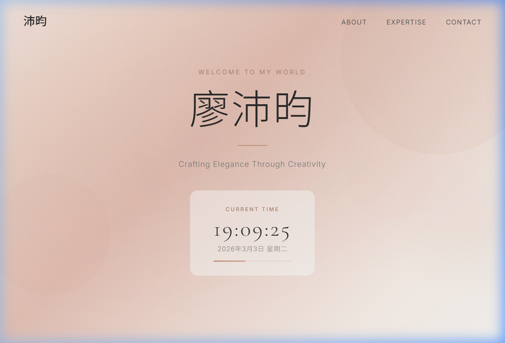

# 廖沛昀 — Personal Portfolio

A sleek, modern single-page personal portfolio website built with pure HTML, CSS, and JavaScript. Designed with a warm, elegant aesthetic featuring soft rose-gold tones and refined typography.

🔗 **Live Demo:** [https://penny0411.github.io/0303/](https://penny0411.github.io/0303/)

## 📸 Preview



## ✨ Features

- **Hero Section** — Full-screen landing with animated floating shapes, a custom cursor glow effect, and the name "廖沛昀" displayed in elegant serif typography
- **Live Clock Widget** — Real-time clock with date display (in Traditional Chinese format) and an animated seconds progress bar
- **About Section** — Personal introduction with scroll-reveal animations
- **Expertise Cards** — Three feature cards (Creative Vision, Strategic Thinking, Continuous Growth) with hover effects and staggered entrance animations
- **Scrolling Marquee** — Infinite horizontal marquee showcasing keywords: Design · Creativity · Innovation · Elegance · Passion
- **Contact CTA** — Call-to-action section with an animated button hover effect
- **Scroll-to-Top Button** — Floating button that appears on scroll for quick navigation
- **Fully Responsive** — Adapts gracefully to mobile, tablet, and desktop screens

## 🎨 Design Highlights

| Element | Detail |
|---|---|
| **Color Palette** | Warm rose-gold (`#c4937e`, `#d4a594`, `#e8c4b8`) on a soft cream (`#faf8f5`) background |
| **Typography** | [Cormorant Garamond](https://fonts.google.com/specimen/Cormorant+Garamond) for headings, [Inter](https://fonts.google.com/specimen/Inter) for body text |
| **Animations** | Fade-slide-up entrances, floating background shapes, scroll-triggered reveals |
| **Effects** | Glassmorphism clock widget, radial cursor glow, marquee text scroll |

## 🛠️ Tech Stack

- **HTML5** — Semantic structure
- **CSS3** — Vanilla CSS with custom properties, keyframe animations, `backdrop-filter`, and responsive media queries
- **JavaScript** — Vanilla JS for the live clock, Intersection Observer for scroll reveals, and dynamic navbar behavior

## 📂 Project Structure

```
L1/
├── index.html    # Single-page portfolio (HTML + CSS + JS all-in-one)
└── README.md     # This file
```

## 🚀 Getting Started

Simply open `index.html` in any modern web browser — no build tools or dependencies required.

```bash
# Clone the repo
git clone https://github.com/penny0411/0303.git

# Open in browser
open index.html
```

## 📋 Development Summary

本專案的完整開發與部署流程如下：

1. **建立個人網頁** — 使用純 HTML、CSS、JavaScript 打造單頁式個人作品集網頁，包含 Hero 區塊、即時時鐘、關於我、專長卡片、跑馬燈、聯絡 CTA 等區段
2. **初始化 Git 儲存庫** — 在專案目錄 `L1/` 中執行 `git init`
3. **首次提交** — 將 `index.html` 加入版本控制並提交：*"Initial commit: personal webpage for 廖沛昀"*
4. **設定遠端倉庫** — 將 GitHub 遠端設為 `https://github.com/penny0411/0303.git`
5. **推送至 GitHub** — 將 `main` 分支推送到遠端倉庫
6. **建立 README.md** — 撰寫完整的專案說明文件，涵蓋功能介紹、設計重點、技術堆疊與使用方式
7. **加入 Live Demo 連結與截圖** — 將 GitHub Pages 網址 (`https://penny0411.github.io/0303/`) 與網頁截圖嵌入 README
8. **加入開發摘要** — 記錄以上所有開發步驟至 README.md

## 📄 License

© 2026 廖沛昀. All rights reserved.
